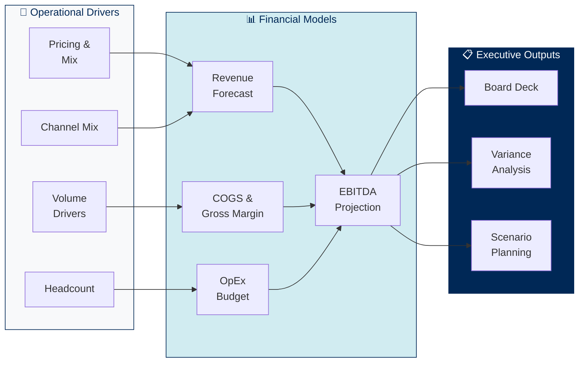
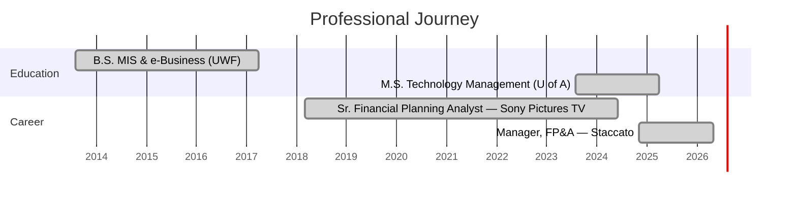

<!-- Dynamic Typing SVG -->

**Building the connective tissue between financial planning and enterprise data architecture**

---

## About

I'm an FP&A and Business Intelligence Manager with 8+ years building the connective tissue between financial planning and enterprise data architecture — not just translating numbers into dashboards, but designing the systems, pipelines, and semantic models that make self-service analytics possible across entire organizations.

My career spans Fortune-level media at **Sony Pictures Television**, where I led cross-functional financial planning across eight international LATAM regions, and PE-backed manufacturing at **Staccato**, where I owned end-to-end FP&A and BI architecture for a multi-segment business. I hold an MS in Technology Management (4.0 GPA) and I'm grounded in the conviction that finance leadership requires not just analytical depth, but architectural vision.

| Metric | Impact |
|:---|:---|
| Forecasting Accuracy | **+30%** improvement across 8 international regions |
| Budget Variances | **25%** reduction via improved forecast models |
| Reporting Automation | **85%** reduction in manual reporting errors |
| T&E Processing Errors | **95%** eliminated through automation |
| Expense Processing Speed | **40%** faster cycle time |
| Cross-Departmental BI Adoption | Scaled to **10+ departments** |

---

## Technical Expertise

#### Financial Planning & Analysis

#### Business Intelligence & Analytics

#### Data & Cloud Platforms

-0078D4?style=flat-square&logo=microsoftazure&logoColor=white)

#### ERP & Integration

---

## Professional Experience

### Manager, Financial Planning & Analysis — Staccato
**Austin, TX · November 2024 – May 2026**

- Owned end-to-end FP&A for a PE-backed manufacturing and consumer-sports business, building driver-based annual budgets and rolling forecasts across multiple P&L segments and delivering board-level ROI/scenario models, variance analysis, and capital investment recommendations that directly informed executive and PE-sponsor decisions.
- Architected a hub-and-spoke enterprise BI platform on **Looker, Azure Synapse, and BigQuery**, scaling real-time GAAP/EBITDA dashboards to **10+ departments and 80+ users** and eliminating significant monthly hours of manual Excel reporting.
- Authored LookML semantic models across department-scoped projects with EBITDA logic, Liquid KPI thresholds, period-over-period measures, and role-based access controls; enforced PR-based CI workflows in GitHub.
- Engineered scalable ETL/ELT pipelines via **Azure Data Factory and T-SQL**, ingesting data from Epicor ERP, Salesforce, BigCommerce, and GA4 into segment-specific LookML semantic models, all versioned with CI-enforced PR workflows.
- Partnered with Finance, Accounting, and PMO on G/L analysis, monthly journal entry validation, SOX compliance, and data integrity assurance across business segments during an active ERP transition, ensuring clean cost allocation.
- Managed and led cross-functional projects with the IT and Finance teams, serving as the strategic bridge between data infrastructure and executive leadership, delegating SQL, LookML, and pipeline engineering tasks via GitHub pull requests and aligning all deliverables to monthly close, segment-level forecasting cycles, and board package deadlines.

### Senior Financial Planning Analyst — Sony Pictures Television
**Miami, FL · March 2018 – June 2024**

- Led cross-functional financial planning across **eight international LATAM regions**, managing multi-million-dollar budgets and forecast models that improved forecasting accuracy by **30%** and reduced budget variances by **25%**, directly supporting executive decisions on programming, distribution, and cost management.
- Owned the consolidated P&L across three major linear channels and eight regions, managing overhead allocations, capital expenditure planning, affiliate revenue analysis, and multi-currency FX exposure, partnering with Accounting on hedging assumptions and USD consolidation.
- Architected an integrated financial reporting infrastructure using **SAP HANA, Microsoft SQL, and Tableau**, delivering board-level and executive KPI dashboards that replaced fragmented Excel workflows with governed, real-time analytics.
- Designed and deployed an **automated T&E reporting system** that eliminated **95% of manual errors** and accelerated expense processing by **40%**, recovering **20+ hours per month** in administrative capacity.
- Built multi-year scenario models for content investments and distribution deals, evaluating payback periods, NPV, and ROI to support greenlight decisions and portfolio strategy.
- Managed affiliate and ad sales revenue recognition across linear and digital channels, coordinating with regional teams on billing accuracy, collections, and monthly AR reporting.
- Developed and presented monthly and quarterly business review decks to corporate and regional leadership, translating complex financial results into executive-level narratives.
- Led finance systems modernization initiative evaluating **Workday Adaptive Planning** for EPM migration, documenting current-state SAP workflows, and defining requirements to transition.

---

## FP&A Methodology

### Driver-Based Planning Framework

I build financial models grounded in operational drivers, not static line items. This approach connects business activities directly to financial outcomes.

### What I Deliver

| Capability | Description |
|:---|:---|
| **Annual Budgets** | Driver-based bottom-up budgets with executive rollup |
| **Rolling Forecasts** | Monthly reforecasts tied to operational actuals |
| **Variance Analysis** | Automated budget vs. actual with narrative explanations |
| **Scenario Modeling** | Best/base/worst case with sensitivity on key drivers |
| **Board Packages** | Consolidated financials with KPI trends and strategic commentary |
| **Headcount Planning** | Compensation budgeting across departments and regions |
| **ROI / NPV Analysis** | Investment justification and payback period modeling |
| **FX Risk Reporting** | Multi-currency P&L consolidation across international markets |

---

## SQL Learning Portfolio

The `/sql` folder contains generic, tutorial-style SQL patterns I've written to demonstrate data modeling techniques commonly used in FP&A and BI work. These are illustrative examples built from publicly documented patterns — **not derived from any employer's proprietary code, schemas, or data**.

| File | Platform | Pattern Demonstrated |
|:---|:---|:---|
| [rolling_revenue_yoy.sql](sql/rolling_revenue_yoy.sql) | Generic ANSI SQL | Window functions, rolling aggregates, YoY comparisons |
| [cohort_retention.sql](sql/cohort_retention.sql) | Generic ANSI SQL | Cohort analysis, retention rates, cumulative revenue |
| [budget_vs_actual.sql](sql/budget_vs_actual.sql) | Generic ANSI SQL | Variance analysis, favorable/unfavorable flagging |
| [headcount_monthly.sql](sql/headcount_monthly.sql) | Generic ANSI SQL | Point-in-time headcount, month-over-month trends |

---

## Career Timeline

---

## Education

| Degree | Institution | Year | Details |
|:---|:---|:---|:---|
| **M.S. Technology Management** | University of Arizona, Global Campus | 2025 | GPA: 4.0 |
| **B.S. General Studies** | University of West Florida, Pensacola, FL | 2017 | Management Information Systems & e-Business |

---

## Contact

Open to conversations about FP&A methodology, enterprise BI architecture, KPI governance, and building analytics platforms that finance leaders actually trust.

---

All code samples in this repository are generic, illustrative patterns built from publicly documented SQL techniques. No proprietary code, schemas, data, or confidential information from any past or current employer is included.

